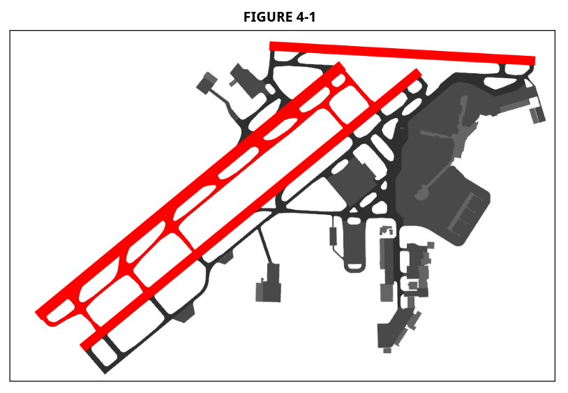

# Cleveland

!!! abstract "Quick Reference"
    - IFR Departure Altitude: 6,000(Jet)/4,000(Prop)
    - IFR Departure Heading:
    - VFR Altitude: 2,500 (Heading 252-058)/3,000(Heading 059-251)
    - Pattern Altitude: 1,800
    - Missed Approach: 4,000

## General

### Positions

| Callsign  | Position           | Radio Name          | Position ID | Frequency |
| --------- | ------------------ | ------------------- | ----------- | --------- |
| CLE_DEL   | Clearance Delivery | Cleveland Delivery  | CD          | 125.050   |
| CLE_GND   | Ground             | Cleveland Ground    | GC          | 121.700   |
| CLE_TWR   | Local              | Cleveland Tower     | L           | 124.500   |
| CLE_A_APP | Feeder             | Cleveland Approach  | A           | 124.000   |
| CLE_F_APP | Final              | Cleveland Approach  | F           | 119.625   |
| CLE_D_DEP | North Departure    | Cleveland Departure | D           | 128.250   |
| CLE_R_DEP | South Departure    | Cleveland Departure | R           | 135.875   |
| CLE_N_APP | North Satellite    | Cleveland Approach  | N           | 125.350   |
| CAK_E_APP | East Satellite     | Cleveland Approach  | E           | 125.500   |
| CAK_S_APP | South Satellite    | Cleveland Approach  | S           | 118.600   |
| MFD_W_APP | West Satellite     | Cleveland Approach  | W           | 128.350   |

### Position Combination

TRACON positions should be opened and combined:

1. CLE_A_APP
    - A/F/D/R/N combined. May use simplified CLE_APP callsign.
    - Solo certified controllers may connect as CLE_S_APP on 124.000.
    - E/S/W may be combined when the positions are not separately staffed by
      another controller.
2. CAK_E_APP
    - E/S combined. May use simplified CAK_APP callsign.
    - W may be combined with E/S when the position is not separated staffed by
      another controller.
3. MFD_W_APP

Other positions may only be opened during events or with the permission of the
ATM/DATM/TA/EC/CIC.

### Transfer of Position Responsibility

1. All personnel shall review authorized sources of information prior to
   beginning the monitor, including the following:
    - Information Display System (IDS) found on the vZOB Site
2. All personnel shall use the position relief checklist provided on the IDS
   page and share equal responsibility for the completeness/accuracy of the
   briefing.
3. All personnel, after verbally providing the position relief briefing, shall
   remain on the position for a minimum of two (2) minutes and advise “monitor
   complete” once the time has elapsed.

## Clearance Delivery

### Issue Clearances / Amendments / Instruction

CD shall issue ATC clearances to IFR and VFR Class B departures as followed:

1. IFR Departures: Standard Instrument Departure Route (SID) should be utilized
   if the aircraft is capable. Aircraft who receive a SID must be issued “Climb
   via SID”. If the aircraft is not filed on a SID, they shall be:
    - Jet: cleared to maintain 6,000ft.
    - Turboprop/Piston: cleared to maintain 4,000ft.
2. GTLKE SID usage:
    - DAIFE transition for use for ORD departures only.
    - BAGEL transition for use for MDW departures only.
    - ALPHE/YABRO transition for use for any departure.
3. Local IFR: aircraft requesting a “local” IFR (destination airports within the
   CLE terminal area) clearance shall be issued 4,000 feet and radar vectors to
   destination airport.
4. VFR Class B Departures: determine destination/direction of flight, clear
   aircraft “out” of CLE Class B, and maintain VFR at or below the following
   altitudes:

| If on-course heading is: | Clear aircraft at or below: |
| ------------------------ | --------------------------- |
| 252 - 058 (Clockwise)    | 2,500                       |
| 059 - 251 (Clockwise)    | 3,000                       |

5. Departure Frequency Designation:
    - Aircraft cleared via GTLKE#, PFLYD#, ZAAPA# and Non-SID departures shall
      be assigned DN (D) as their departure frequency.
    - Aircraft cleared via CAVVS# and KKIDS# shall be assigned DS (R) as their
      departure frequency.
6. Ensure that all aircraft requesting clearance have current ATIS code.

### Weather Information/ATIS

#### Receiving

1. CLE weather should be received via the ATC client or the Aviation Weather
   Center.
2. CWAs, SIGMETs, AIRMETs, and NOTAMs should be received from the Aviation
   Weather Center and/or the FAA.

#### Disseminating

1. CD shall ensure that all Tower control positions and TRACON receive the new
   ATIS code.
2. CD shall notify CIC when weather changes from VFR to IFR or from IFR to VFR.

## Ground Control

### Jurisdiction of Movement Area

GC has jurisdiction of the movement area north of runway 06L/24R extended
centerline and south of runway 06R/24L extended centerline. Areas shaded red in
Figure 4-1[^1] are owned by LC unless otherwise coordinated.

### Scanning Movement Area

GC shall be aware of and operationally scan the work environment and following
problem/restricted areas:

- Only ONE aircraft shall have clearance to move on taxiway H.
- All helicopter movements under control of LC shall be monitored carefully and
  subsequent aircraft movements shall be planned around these helicopter
  movements by GC.

### Plan Ground Movement

1. IAW the usage of the CLE ASSC, GC shall ensure all aircraft are squawking
   mode normal/C prior to being issued further ground movement clearance.
2. GC shall ensure to not allow aircraft to proceed on to a runway without
   transfer of control or approval from LC.
3. GC shall coordinate with LC all requests for intersection departures or
   secondary runway usage.
4. If non-standard runway departure is requested, GC shall coordinate with LC
   prior to taxi clearance.
5. GC shall give way to aircraft exiting runways unless otherwise coordinated.
6. GC shall be made aware of local in-trail restrictions and as necessary:
   sequence traffic on taxiway to expedite departures. Sequencing aircraft based
   off of routing shall be IAW 3.1d/e.

### Runway Crossing

1. Usage of active runway shall remain the responsibility of LC. GC shall NOT
   cross runways designated as active, unless coordinated and approved by LC.
2. When coordinating runway crossings, GC shall request by providing the runway
   number and intersection for which the aircraft shall be crossed.
    - If the request is approved, LC shall explicitly state “cross” followed by
      the runway designation and intersection.
    - If the request is unable to be approved, LC shall NOT state “cross” but
      instead shall explicitly state “hold short of runway (designation)”.
    - Upon crossing completion, GC shall advise LC by stating “crossing
      complete” followed by the controller’s operational initials (OIs).

## Local Control

### Jurisdiction of Airspace

LC has jurisdiction of airspace as follows, and has control of aircraft when
talking to any aircraft within 10NM of the airport unless otherwise coordinated.

1. South Flow and West Flow
2. North Flow

### Departure Procedures

1. LC is responsible for ensuring initial separation between departures and
   other aircraft (i.e. successive departure, missed approach, VFR), and is
   permitted by DN/DS to automatically release aircraft with the exception of
   local IFR.
2. In north flow:
    - SID aircraft shall be cleared for takeoff and fly their ROTG pilot-nav
      segment IAW their filed SID.
    - Non-SID aircraft with their route parallel to GTLKE#, PFLYD#, ZAAPA# SIDs
      shall be issued a heading in the range of RWY clockwise to 320°.
    - Non-SID aircraft with their route parallel to CAVVS# and KKIDS# SIDs shall
      be issued a heading in the range of RWY counter-clockwise to 100°.
    - LC shall enter the assigned heading in the scratchpad accordingly.
3. In south flow:
    - SID aircraft shall be cleared for takeoff and fly their ROTG pilot-nav
      segment IAW their filed SID.
    - Non-SID aircraft with their route parallel to GTLKE#, PFLYD#, ZAAPA# SIDs
      shall be issued heading in the range of RWY clockwise to 320°.
    - Non-SID aircraft with their route parallel to CAVVS# and KKIDS# SIDs shall
      be issued a heading in the range of RWY counter-clockwise to 180°.
    - LC shall enter the assigned heading in the scratchpad accordingly.
4. In west flow:
    - GTLKE#, PFLYD#, ZAAPA# aircraft and non-SID aircraft with its route
      parallel to those SIDs shall be issued a heading in the range of RWY
      clockwise to 320°.
    - CAVVS# and KKIDS# aircraft and non-SID aircraft with its route parallel to
      those SIDs shall be issued a heading in the range of RWY counter-clockwise
      to 180°.
    - LC shall enter the assigned heading in the scratchpad accordingly.
5. LC is responsible for ensuring 3NM separation or greater between subsequent
   departures on the *same* RNAV SID.
    - **NOTE**: GTLKE# and ZAAPA# in NORTH FLOW are considered the same RNAV SID
      and require 3 miles or greater from LC to radar.

### Intersection Departures

LC shall provide runway distance remaining for intersection departure.

#### Runway 24L

| INT | Distance (Ft) |
| --- | ------------- |
| S   | 7392          |
| A   | 6864          |
| L3  | 4752          |
| N   | 3138          |

#### Runway 6R

| INT | Distance (Ft) |
| --- | ------------- |
| L2  | 7392          |
| P   | 6864          |
| N   | 5808          |
| L4  | 3693          |

#### Runway 24R

| INT | Distance (Ft) |
| --- | ------------- |
| G5  | 6336          |
| G4  | 5180          |
| G3  | 4224          |
| N   | 3138          |

#### Runway 6L

| INT | Distance (Ft) |
| --- | ------------- |
| P   | 5808          |
| N   | 4752          |
| G3  | 6396          |

### Line Up and Wait (LUAW) Procedures

LUAW is authorized at CLE IAW FAA directives and under the following criteria:

- During daylight hours: LUAW is authorized for all runways.
- During night time hours: LUAW is NOT authorized between sunset and sunrise.
- If the reported weather ceiling is less than 800ft or the visibility less than
  2sm then two separate aircraft shall not be both holding in position or
  cleared to land at the same time.

### Arrival Procedures

1. Arrival is not responsible for notifying LC of arriving aircraft unless the
   aircraft is bound for a secondary arrival runway.
2. LC shall confirm radar identification of aircraft of each arrival and scan
   scratchpad information to correlate type of approach and runway assignment.
3. LC shall ensure separation between all arriving aircraft and participating
   Class B aircraft, and is responsible for the final sequence of aircraft into
   the airport.
4. When an arrival aircraft exits the runway, issue an initial taxi clearance
   that permits the aircraft to keep moving, clearing runway exits, without
   infringing on GC’s operation or designated control area.

### Reduced Separation Procedures

Reduced longitudinal separation of 2.5NM between aircraft established on the
final approach course within 10NM of the landing runway is authorized for
24L/06R and 24R/06L when running independently. The following conditions must be
met:

1. The weight class of the leading aircraft is the same as or less than the
   trailing aircraft.
2. Heavy aircraft and B757 are permitted to participate as the trailing aircraft
   only.

### Go Arounds and Missed Approaches

1. LC must advise the departure sector (DN/DS) which will provide radar service
   to the aircraft executing a missed approach or go-around.
2. LC must assign the aircraft 4,000ft and a heading IAW the dispersal areas
   defined in 5.1. The affected departure sector must be advised of this heading
   assignment prior to transfer of communication.

### Certified Tower Radar Display (CTRD)

CLE is equipped with a CTRD that may be utilized to provide radar service as
deemed necessary IAW FAAO 7110.65 3-1-9.b. Additionally, LC shall issue radar
traffic advisories IAW FAAO 7110.65 2-1-21a.

### Helicopter Operations

All movement areas are authorized for helicopter operations. When conducting
helicopter operations LC shall coordinate with GC prior to issuing
arrival/departure instructions to/from any location on the field other than
active runways.

## RADAR

### Jurisdiction of Airspace

Jurisdiction for the radar airspace is graphically defined per flow in
Appendices[^2] 3, 4, and 5.

### CLE ("North") Sector

#### Pre-Arranged Coordination Procedures (P-ACP)

DN (D)/DS (R) may permit only departures to penetrate arrival airspace, and are
subject to the following limitations:

1. DN/DS must quicklook the arrival controller.
2. DN/DS is responsible for lateral and vertical separation (incl. wake
   turbulence separation) from all traffic.
3. Arrival must point out all primary targets, unassociated tracks, and
   associated tracks in coast status within their airspace to DN/DS. DN/DS must
   do the same with arrival.

#### Diverse Vector Area (DVA)

Within the DVA, random vectors may be assigned to IFR aircraft below the Minimum
Vectoring Altitude (MVA) IAW DVA procedure and facility directive. The following
DVAs are defined for BKL departures assigned 2,000ft:

1. BKL RWY 24R/06L/06R: 300° clockwise to 050° within 9nm.
2. BKL RWY 24L: does NOT have a defined DVA. Aircraft must be assigned the RWY
   24L ODP.

#### Cleveland (CLE) Departures

1. Departures exiting the CLE TRACON shall be IAW CLE-ZOB LOA.
2. DN/DS assume separation responsibilities when altering Tower assigned
   headings.
3. After a runway change, advise the tower when to begin departures.
4. When vectoring to KKIDS waypoint, DS must not intercept KKIDS at more than a
   45° intercept.
5. P-ACP is approved for DN/DS with arrival IAW 6.1.2.

#### Departure to Satellite Handoff

As necessary, DN/DS handoff aircraft to CLE Satellite (N/S/E/W) with approval
for control for turns up to 30° left/right and descent at the following
altitudes:

1. Satellite North (N): lowest available altitude within CLE DN/DS airspace.
2. Satellite South (S)/East (E): at or descending to 5,000ft.
3. Satellite West (W): at or descending to 4,000ft.

#### Cleveland (CLE) Arrivals

1. Arrivals entering the CLE TRACON are IAW the CLE-ZOB LOA.
2. A/F should only utilize runway(s) designated as “arrival” runway(s) by the
   tower.
3. A/F are not responsible for notifying LC of arriving aircraft unless the
   aircraft is bound for a runway not designated as an “arrival” runway. This
   request should be coordinated prior to issuance of approach clearance.
4. A/F must transfer radar identification of an arriving aircraft to LC prior to
   the FAF.
5. Reduced longitudinal separation authorized for all runways except IAW 5.6.
6. When conducting visual approaches, the following final approach crossing
   restrictions must be cleared to aircraft:

| Runway | Distance                     | Altitude  |
| ------ | ---------------------------- | --------- |
| 24R    | Cross 6.5 DME or abeam SHERK | AOA 3,000 |
| 24L    | Cross 8.6 DME or abeam ALOMR | AOA 3,000 |
| 6L     | Cross 9 DME                  | AOA 3,000 |
| 6R     | Cross 9 DME                  | AOA 3,000 |
| 10     | Cross 8 DME                  | AOA 3,000 |
| 28     | Cross 8 DME                  | AOA 3,000 |

#### Satellite Arrivals

1. Aircraft arriving on RNAV STARs for satellite airports shall be descended
   into CLE N airspace.
2. When CLE is landing RWY 24R/L and BKL is landing RWY 6L/6R: any turbojet/prop
   aircraft landing BKL must be pointed out to A, or F when open.
3. It is recommended that CLE N stagger arrivals between BKL offset localizer
   RWY 24R and CGF RWY 24. CLE N shall closely monitor this area when BKL/CGF
   are both in south flow.
4. CLE N authorizes BKL and CGF LC to utilize their Tower Display Workstations
   equipped at their tower facilities IAW FAAO 7110.65 3-1-9.b.
5. CLE N is not responsible for notifying LC of arriving aircraft unless the
   aircraft is bound for a runway not designated as an “arrival” runway. This
   request should be coordinated prior to issuance of approach clearance.
6. CLE N shall verbally coordinate any non-tagged aircraft with CGF/BKL prior to
   10nm from BKL or CGF airport.
7. CLE N has authorization to vector aircraft through the areas defined in
   Appendix[^2] 2 with BKL and CGF so long as vertical and lateral separation
   are maintained between participating and non-participating traffic.
8. CLE N shall transfer communication of arriving aircraft between 5-10 flying
   miles from BKL and CGF.

#### Approach Scratchpad Usage

See [Scratchpad Usage](../../reference_tables/scratchpads.md).

### CAK ("South") Sector

#### Jurisdiction of Airspace

Jurisdiction for the radar airspace is graphically defined in Appendices[^2] 6
and 7. Two configuration (config) plans are available. The following are
available to assist in planning the use of configs when splitting CLE E/CLE S:

1. Config 1 is primarily used when arriving RWYs 05 and 01.
2. Config 2 is primarily used when arriving RWYs 23 and 19.

#### Departures

1. Departures exiting the CAK Sector shall be IAW the CLE-ZOB LOA.
2. In Config 1: CAK S handles westbound departures. CAK E handles east/southeast
   and southwest bound departures.
3. In Config 2: CAK S handles west/southwest bound departures. CAK E handles
   east/southeast bound departures.

#### Arrivals

1. Arrivals entering the CAK Sector are IAW CLE-ZOB LOA and, from CLE Sector,
   IAW 6.1.5b.
2. In Config 1:
    - CLE S assumes the CAK RWY 05 approach course.
    - CLE S assumes the AKR RWY 05 approach course, and points out aircraft to
      CLE E when necessary.
    - CLE E assumes the CAK RWY 23 approach course.
    - CLE E assumes the CAK RWY 01 and CAK RWY 19 approach course and assumes
      the approval authority of the sequence.
    - LAHSO is regularly in use at CAK. Coordinate any aircraft NOT capable or
      willing to participate in LAHSO.
3. In Config 2:
    - CLE S assumes the CAK RWY 19 approach course.
    - CLE S assumes the CAK RWY 05 approach courses and assumes the approval
      authority of the sequence.
    - CLE S assumes the AKR RWY 23 approach course, and points out aircraft to
      CLE E when necessary.
    - CLE E assumes the CAK RWY 01 approach course.
    - CLE E assumes the CAK RWY 23 approach course and assumes the approval
      authority of the sequence.
    - LAHSO is regularly in use at CAK. Coordinate any aircraft NOT capable or
      willing to participate in LAHSO.
4. CLE E/S authorizes CAK LC to utilize their Tower Display Workstation equipped
   at their tower facility IAW FAAO 7110.65 3-1-9.b.
5. CLE E/S are not responsible for notifying LC of arriving aircraft unless the
   aircraft is bound for a runway not designated as an “arrival” runway. This
   request should be coordinated prior to issuance of approach clearance.
6. CLE E/S shall verbally coordinate any non-tagged aircraft with LC prior to
   10nm from CAK airport.
7. CLE E/S shall transfer communication of arriving aircraft between 5-10 flying
   miles from CAK airport.

#### Youngstown Procedure

CLE S/E will ensure coordination with YNG ATCT for all IFR aircraft arriving or
departing to/from 4G4 airport.

#### Approach Scratchpad Usage

See [Scratchpad Usage](../../reference_tables/scratchpads.md).

### MFD ("West") Sector

#### Jurisdiction of Airspace

Jurisdiction for the radar airspace is graphically defined in Appendix[^2] 8.

#### Departures

Departures exiting the MFD Sector shall be IAW the CLE-ZOB LOA.

#### Arrivals

1. Arrivals entering the MFD Sector are IAW CLE-ZOB LOA and, from CLE Sector,
   IAW 6.1.5c.
2. CLE W authorizes MFD LC to utilize their Tower Display Workstation equipped
   at their tower facility IAW FAAO 7110.65 3-1-9.b.
3. CLE W are not responsible for notifying LC of arriving aircraft unless the
   aircraft is bound for a runway not designated as an “arrival” runway. This
   request should be coordinated prior to issuance of approach clearance.
4. CLE W shall verbally coordinate any non-tagged aircraft with LC prior to 10nm
   from MFD airport.
5. CLE W shall transfer communication of arriving aircraft between 5-15 flying
   miles from MFD airport.

#### Approach Scratchpad Usage

See [Scratchpad Usage](../../reference_tables/scratchpads.md).

[^1]:
    Areas of the movement area reserved for Local Control:
    

[^2]:
    The appendices can be found in the latest `Cleveland ATCT/TRACON (CLE) SOP`
    from the Cleveland Center website's
    [Downloads page](https://clevelandcenter.org/downloads).
